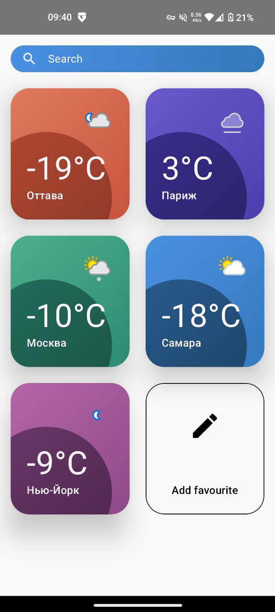

# Weather App 🌦️

Приложение для просмотра прогноза погоды в разных городах мира. Проект выполнен как **демонстрационный pet‑project** для портфолио и резюме Android‑разработчика.

---

## 📱 О проекте

Weather App — это Android‑приложение, реализованное с упором на **чистую архитектуру**, **односторонний поток данных (MVI)** и современный Android‑стек. Проект демонстрирует навыки работы с сетевыми запросами, локальным кэшированием, управлением состоянием и декларативным UI.

---

## 🛠️ Технологический стек

* **Язык:** Kotlin
* **UI:** Jetpack Compose
* **Архитектура:** MVI
* **Навигация / decomposition:** Decompose
* **Асинхронность:** Coroutines, Flow
* **Сеть:** Retrofit, OkHttp3
* **DI:** Dagger 2
* **Хранение данных:** Room
* **Изображения:** Glide
* **Графика:** Canvas

---

## 🧱 Архитектура

Проект построен по принципам **Clean Architecture**:

* `presentation` — UI (Compose), состояния, intents, reducers
* `domain` — бизнес‑логика, use cases, модели
* `data` — работа с API, БД и маппинг данных

Используется **MVI‑подход**:

* одно источник состояния (State)
* события пользователя (Intent)
* реакция через Reducer

---

## 🖼️ Пример UI

<p>
  
  
  
</p>

---

## ⚙️ Сборка и запуск проекта

1. Склонируйте репозиторий:

   ```bash
   git clone https://github.com/your-username/weather-app.git
   ```

2. В файл `gradle.properties` добавьте API‑ключ:

   ```properties
   apikey=YOUR_API_KEY
   ```

3. Соберите и запустите проект в Android Studio.

---

## 🎯 Что демонстрирует проект

* работу с REST API
* обработку состояний загрузки / ошибок
* Compose UI + state hoisting
* MVI на практике
* модульность и читаемую архитектуру
* DI без Hilt (чистый Dagger 2)

---

## 🚀 Планы по развитию

* [ ] Добавить unit‑тесты (ViewModel / Reducer)
* [ ] Поддержка темы (Light / Dark)
* [ ] Offline‑режим
* [ ] Мульти‑модульная структура

